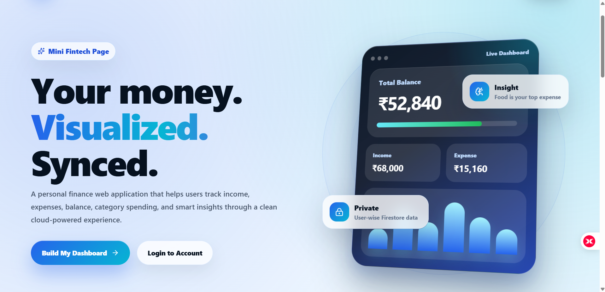
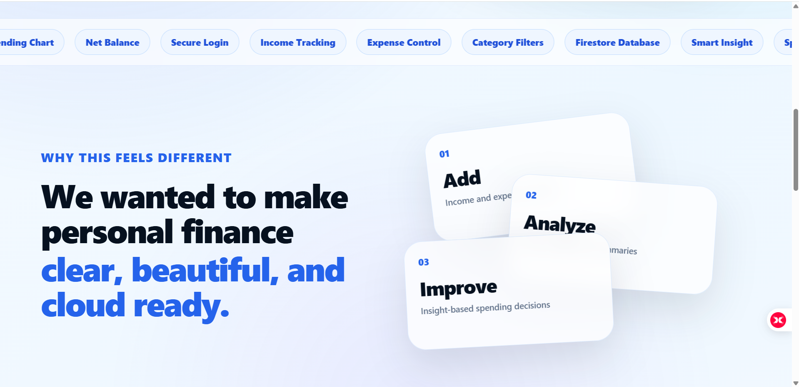
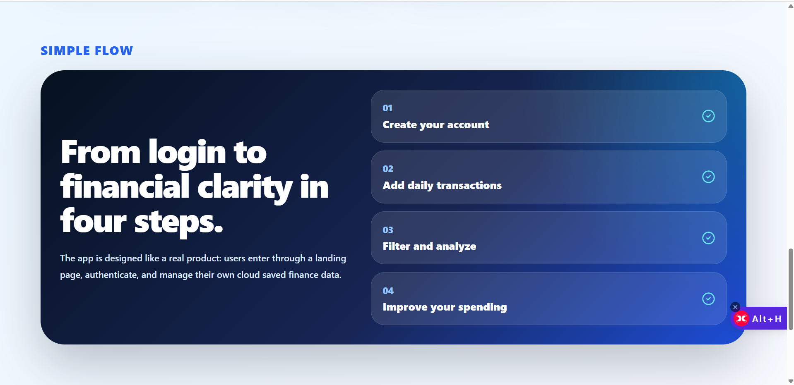
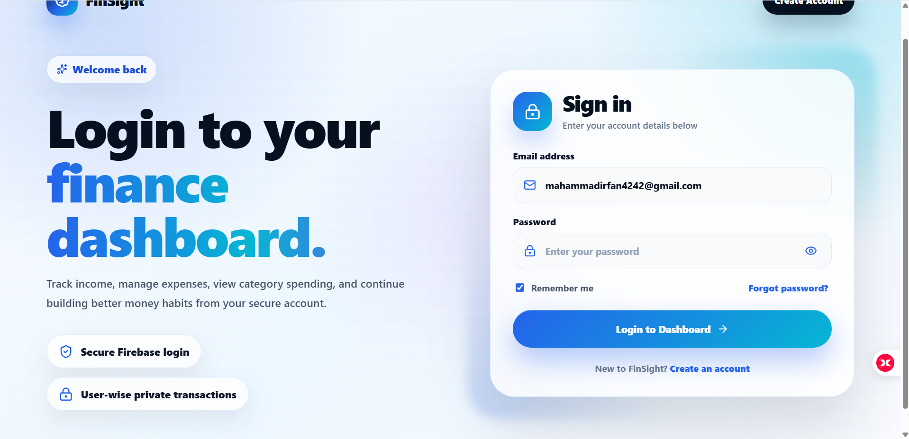
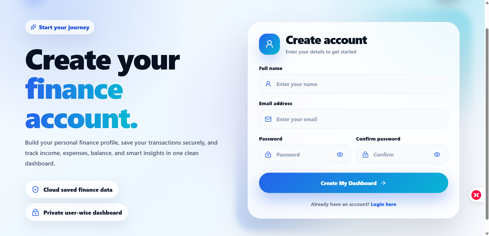
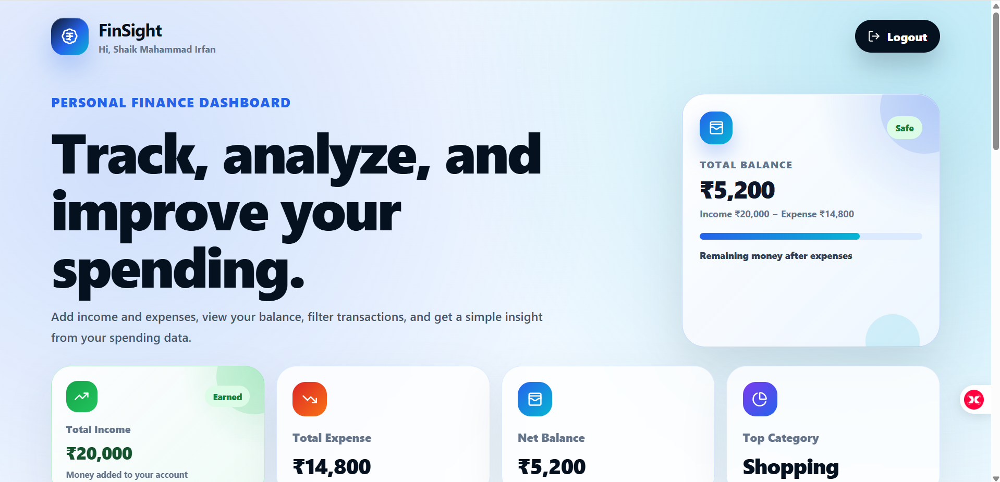
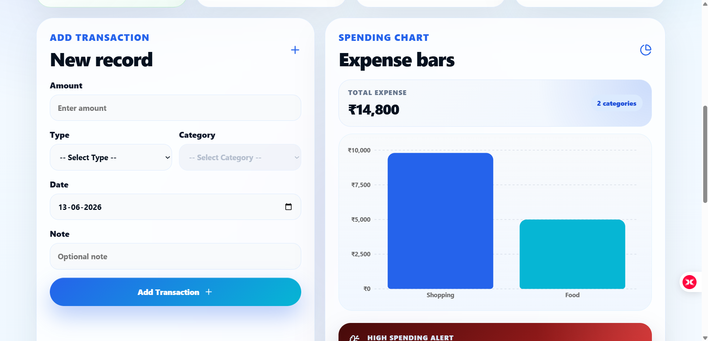
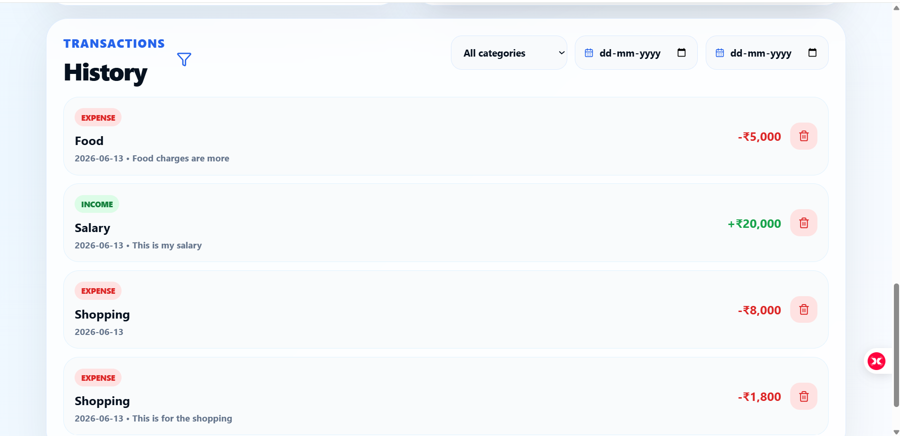
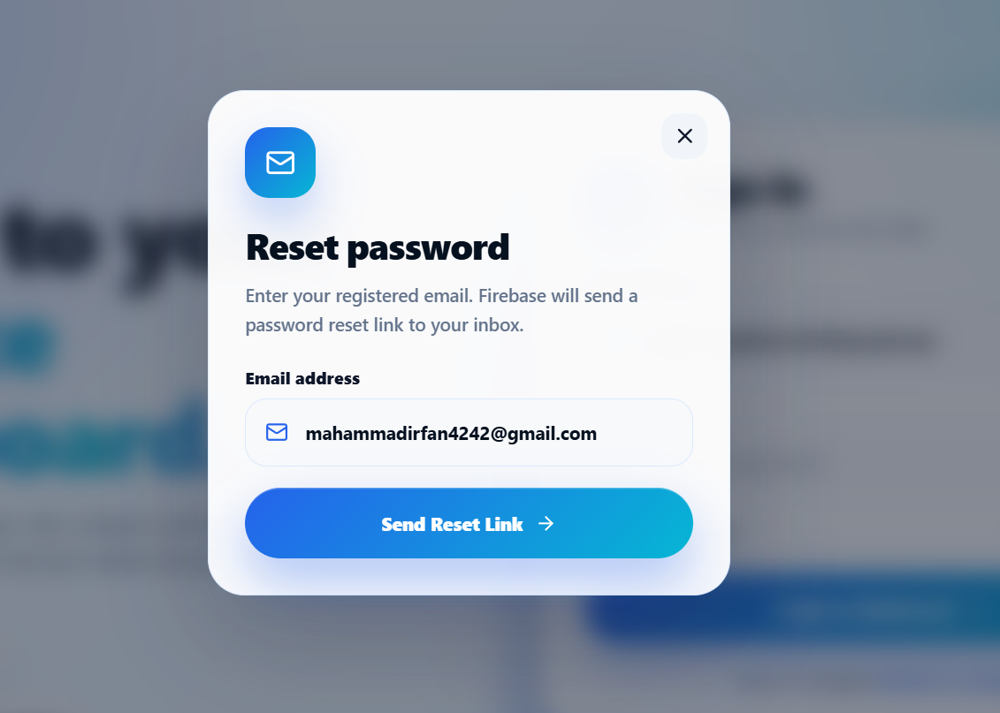

# FinSight - Personal Finance Dashboard

FinSight is a simple personal finance dashboard. It helps users track their income, expenses, balance, and spending habits in one place.

The main idea of this project is to make money tracking easy. A user can add income and expense records, see where the money is going, and understand spending through charts and smart alerts.

## Live Demo

Hosted URL: Not deployed yet

## Demo Video

Watch the project demo here:

[Click here to watch the demo video](PASTE_YOUR_VIDEO_LINK_HERE)

## GitHub Repository

Repository URL: `https://github.com/Irfan211-prog/finsight`

## Features

* User registration and login
* Forgot password option
* Remember me option
* Add income and expense transactions
* Separate categories for income and expenses
* View total income
* View total expenses
* View remaining balance
* Category-wise expense bar graph
* Smart spending alerts
* Filter transactions by category and date
* Delete transactions
* Responsive and modern dashboard UI

## Tech Stack

* React
* TypeScript
* Vite
* Firebase Authentication
* Cloud Firestore
* Recharts
* Lucide React Icons
* CSS

## Project Structure

```text
finsight/
├── public/
│   └── finsight.png
├── src/
│   ├── pages/
│   │   ├── LandingPage.tsx
│   │   ├── LoginPage.tsx
│   │   ├── RegisterPage.tsx
│   │   └── DashboardPage.tsx
│   ├── services/
│   │   └── firebase.ts
│   ├── styles/
│   │   ├── landing.css
│   │   ├── login.css
│   │   ├── register.css
│   │   └── dashboard.css
│   ├── App.tsx
│   └── main.tsx
├── index.html
├── package.json
└── README.md
```

## Screenshots

### Landing Page - Section 1



### Landing Page - Section 2



### Landing Page - Section 3



### Login Page



### Register Page



### Dashboard Page - Overview



### Dashboard Page - Add Transaction and Chart



### Dashboard Page - Transaction History



### Forgot Password Popup



## Firebase Setup

Create a Firebase project from Firebase Console.

Enable these services:

* Authentication
* Email/Password login
* Cloud Firestore

Create a file named `firebase.ts` inside:

```text
src/services/firebase.ts
```

Add your Firebase config:

```ts
import { initializeApp } from "firebase/app";
import { getAuth } from "firebase/auth";
import { getFirestore } from "firebase/firestore";

const firebaseConfig = {
  apiKey: "YOUR_API_KEY",
  authDomain: "YOUR_AUTH_DOMAIN",
  projectId: "YOUR_PROJECT_ID",
  storageBucket: "YOUR_STORAGE_BUCKET",
  messagingSenderId: "YOUR_MESSAGING_SENDER_ID",
  appId: "YOUR_APP_ID",
};

const app = initializeApp(firebaseConfig);

export const auth = getAuth(app);
export const db = getFirestore(app);
```

## Firestore Collections

### users

This collection stores user details.

Example:

```js
{
  name: "User Name",
  email: "user@example.com",
  createdAt: timestamp
}
```

### transactions

This collection stores income and expense records.

Example:

```js
{
  userId: "firebase-user-id",
  amount: 1000,
  category: "Food",
  type: "expense",
  date: "2026-06-13",
  note: "Lunch",
  createdAt: timestamp
}
```

## Firestore Rules

Use these rules to make sure users can access only their own data.

```js
rules_version = '2';

service cloud.firestore {
  match /databases/{database}/documents {

    match /users/{userId} {
      allow read, write: if request.auth != null && request.auth.uid == userId;
    }

    match /transactions/{transactionId} {
      allow read, create: if request.auth != null
        && request.auth.uid == request.resource.data.userId;

      allow update, delete: if request.auth != null
        && request.auth.uid == resource.data.userId;
    }
  }
}
```

## Installation

Clone the repository:

```bash
git clone https://github.com/Irfan211-prog/finsight.git
```

Go to the project folder:

```bash
cd finsight
```

Install dependencies:

```bash
npm install
```

Install required packages:

```bash
npm install firebase react-router-dom lucide-react recharts
```

Run the project:

```bash
npm run dev
```

Open the app in browser:

```text
http://localhost:5173
```

## Build Command

To build the project for production:

```bash
npm run build
```

## Deployment

This project can be deployed on Vercel, Netlify, Render, or any similar hosting platform.

For Vercel:

1. Push the project to GitHub
2. Open Vercel
3. Import the GitHub repository
4. Select Vite as the framework
5. Use this build command:

```bash
npm run build
```

6. Use this output folder:

```text
dist
```

7. Click Deploy

## How to Use

1. Create an account
2. Login with email and password
3. Add income like Salary or Freelance
4. Add expenses like Food, Travel, Shopping, Bills, Education, or Health
5. View total income, total expense, and balance
6. Check the expense bar graph
7. Read the smart insight shown by the dashboard
8. Filter or delete transactions when needed

## Project Goal

The goal of FinSight is to help users understand their money clearly. It does not only store income and expenses. It also shows useful alerts so users can control spending and improve savings.

## Author

Shaik Mahammad Irfan